# OpenWheels

**OpenWheels — an open-source reimplementation of Happy Wheels.**

OpenWheels rebuilds *Happy Wheels* mobile (Android 1.1.3, cocos2d-x 3.17.2 + Box2D) as readable
C++, class for class and function for function, and runs it natively on Windows, Linux, macOS,
Android and iOS. On
top of that faithful core it adds the things the mobile game never had: the iOS level editor,
online browser levels from totaljerkface.com, the five browser-only characters, and a Quality of
Life options page. There are no ads, and the game doesn't need to be online.

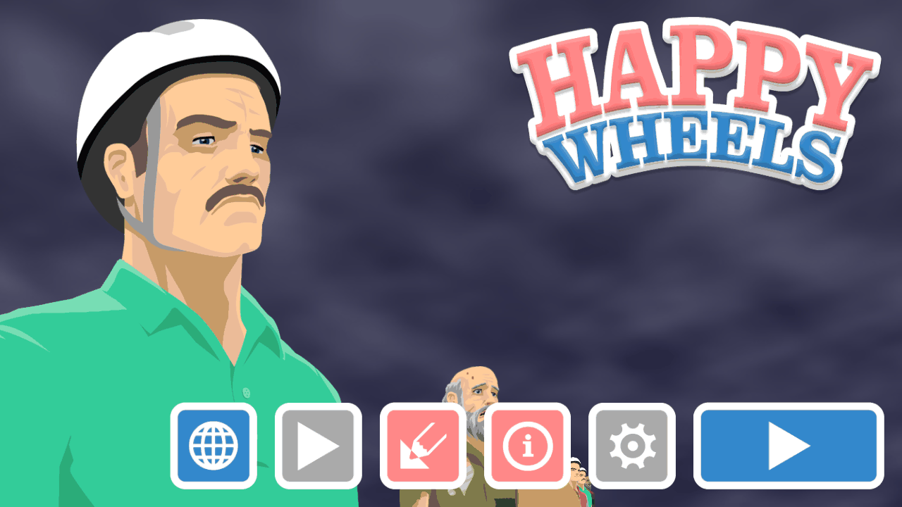

> OpenWheels is an unofficial fan project. It is not affiliated with or endorsed by Fancy Force or
> Jim Bonacci. The source tree contains **no game assets**. See [Legal](#legal).

## Features

### A 1:1 reconstruction of the mobile game

Every class of the original `libMyGame.so` was rebuilt with its original names, signatures and
behaviour. That covers the characters and ragdolls, vehicles, level loading, items and triggers,
gameplay, menus and windows. Parity is measured, not assumed: the original game runs in an arm64
emulator (the "oracle"), and the reconstruction's Box2D world is compared with it body by body.
**All 73 campaign levels load into a world identical to the original's.** Over long runs the
physics drifts slightly, because MSVC rounds floats differently from the original's clang build;
see [docs/PARITY.md](docs/PARITY.md).

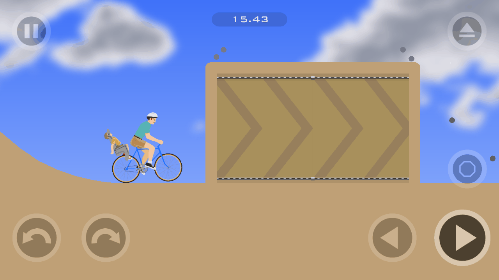

### Eleven playable characters

The six mobile characters plus the five that only existed in the browser game, all in character
select. Each restored character has his or her own vehicle, controls, gore and sounds:
**Lawnmower Man**, **Explorer Guy**, **Santa Claus**, **Irresponsible Mom** and **Helicopter
Man**. They are rebuilt at build time from your own copy of the browser game's character files;
see [docs/RESTORED.md](docs/RESTORED.md).

Each of them also gets **a campaign chapter of their own**: six new levels per character, made
for OpenWheels, after the original chapters in the level select, with their own main-menu
portraits. See [docs/RESTORED.md](docs/RESTORED.md#restored-character-campaigns).

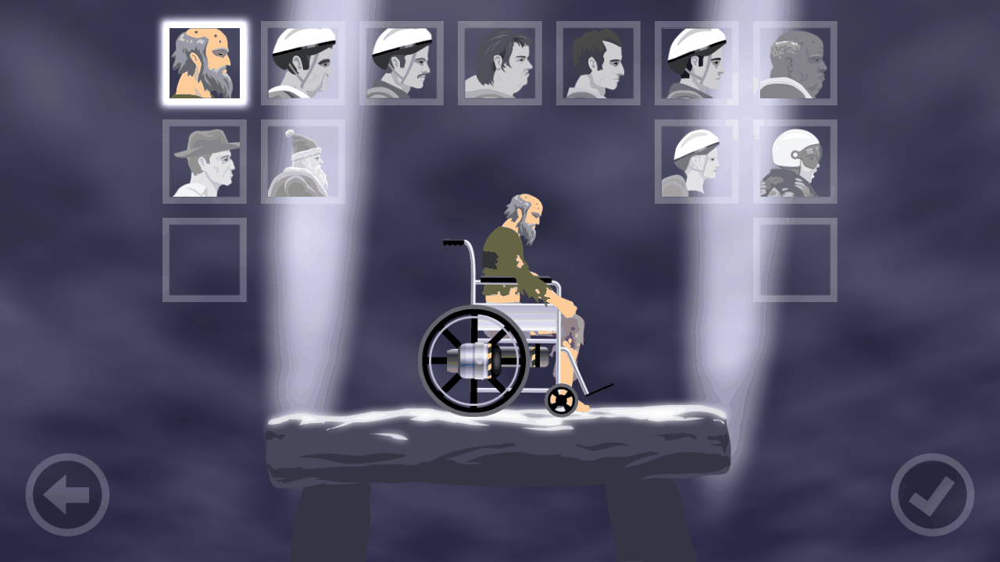

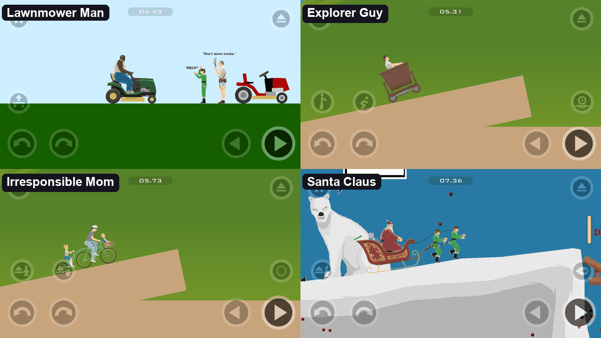

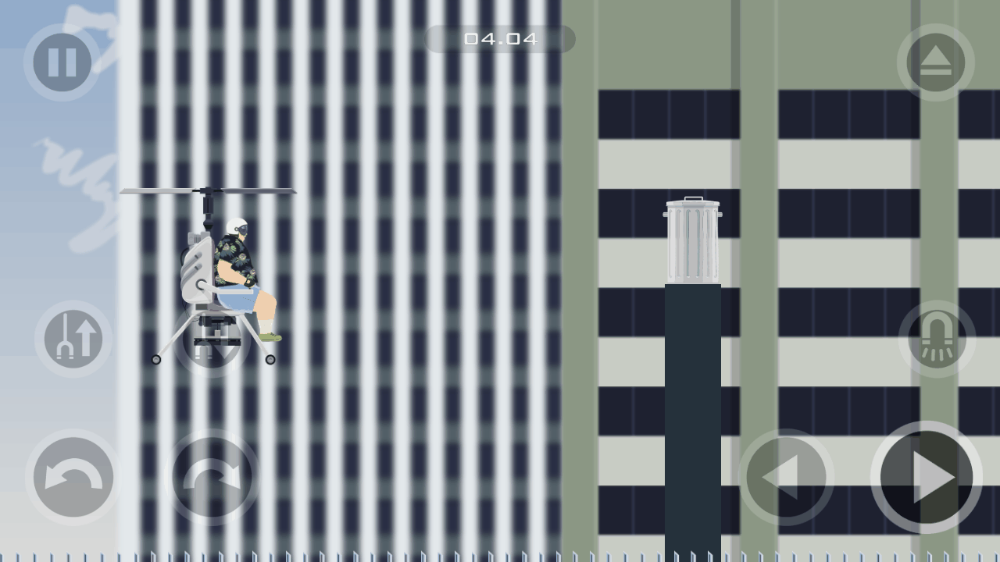

### Level editor

The iOS version had a level editor that Android never got. OpenWheels ports it and extends it with
**everything the browser game's editor can do**: NPCs, text boxes, signs, food, furniture, cannons,
chains, paddles, tokens and buildings; polygon and art shapes; **triggers** with per-target action
lists; pin and sliding **joints**; **groups** and user-built **vehicles**; all 11 characters and the
city background. On PC it has full mouse and keyboard editing (box select, copy/paste, undo/redo,
nudge, zoom, pan), and any online level can be opened with **Edit** to remix it. See
[docs/EDITOR_PORT.md](docs/EDITOR_PORT.md).

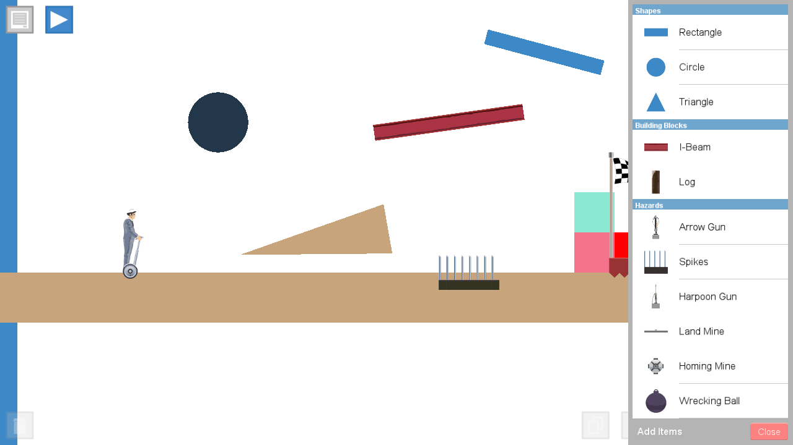

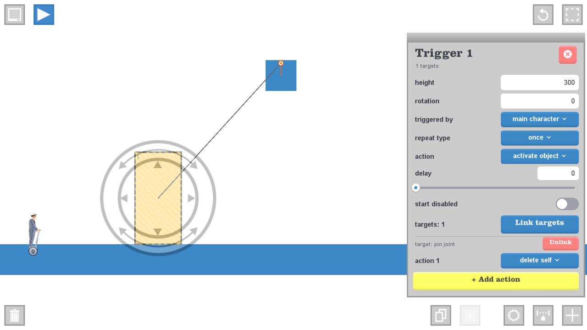

### Your levels, sent over Wi-Fi

Your Levels keeps everything you've built or received. **Send to Nearby** sends a level to anyone
running OpenWheels on the same Wi-Fi (PC or phone); they get an Accept / Decline prompt and can
play it straight away. See [docs/NEARBY.md](docs/NEARBY.md).

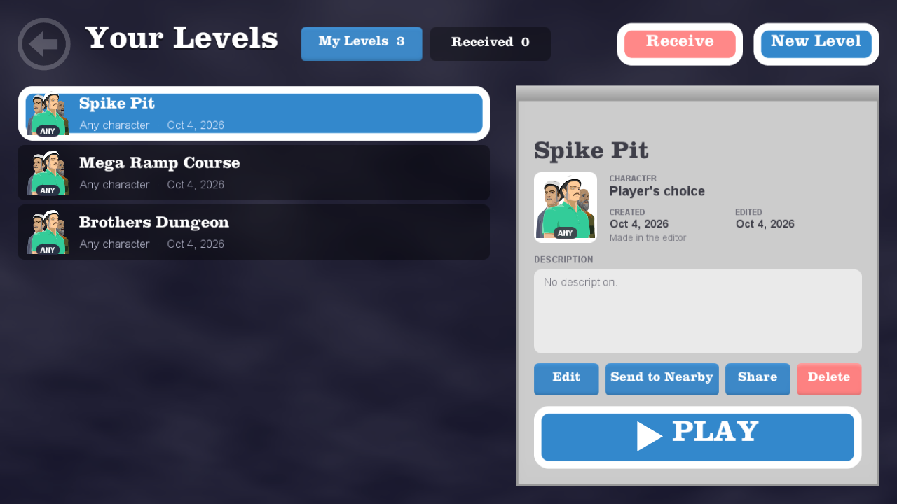

### Ghost racing

Race friends on the same Wi-Fi on any campaign, user or online level. Everyone rides their own
world; the other players appear as tinted, see-through **ghosts** behind you, complete with
ragdolls, lost limbs, gore and broken vehicles. Race HUD, results and rematches. See
[docs/RACE.md](docs/RACE.md).

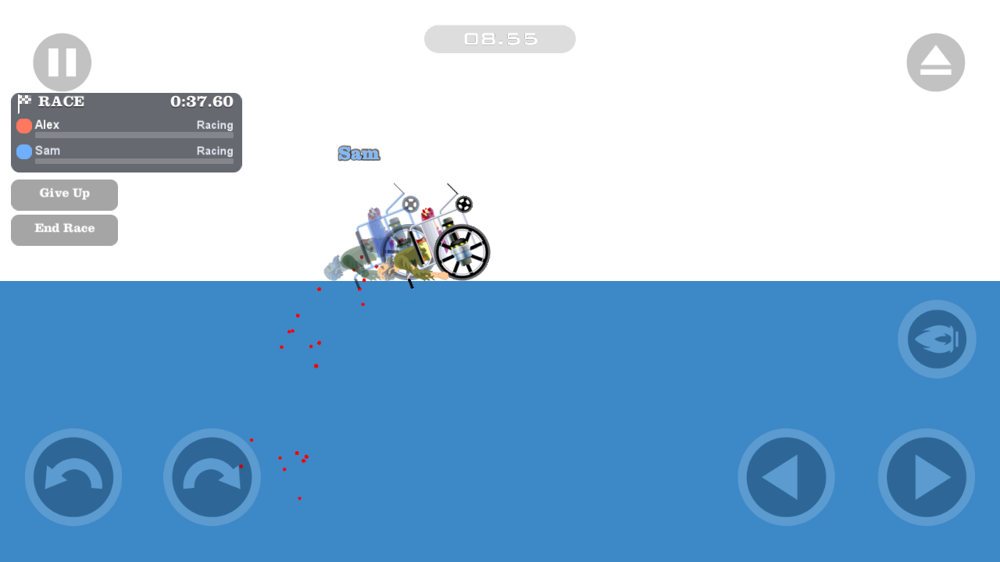

### Online levels from the browser game

Search and browse the browser game's user levels on totaljerkface.com (top rated, most played,
newest and more), then download and play them. Levels are decrypted and converted to the mobile format on the
fly. The browser-only features are implemented too: NPC characters, text boxes, triggers,
furniture and other items, user-built vehicles, the city background and the browser game's sounds.
See [docs/FLASH_LEVELS.md](docs/FLASH_LEVELS.md).

Each level also has its **replays and record times**: watch them, record and upload your own runs,
and rate them. **Log in** with your totaljerkface.com account for favorites, ratings, your levels
and replays, and publishing levels made in the editor.

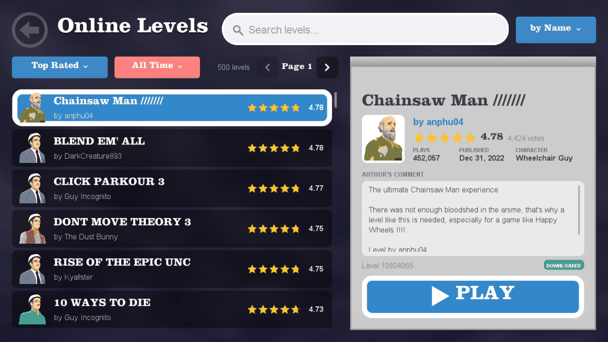

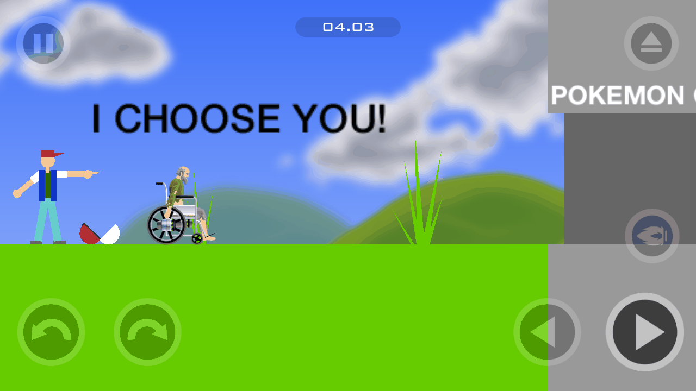

### Quality of Life options

*Options → quality of life* collects the extras. Every option defaults to the original game's
behaviour:

- **Blood:** classic, streaks, liquid or realistic (the four blood settings of the browser game)
- **Max particles:** 2000 (original), 4000 or 8000
- **Camera:** normal, or three levels of zoom-out
- **Textures:** auto (the original's choice) or a fixed large / medium / small / tiny asset tier
- **Frame rate:** 60 (original) or 30 FPS, like the browser game; the physics run the same steps
- **Sound effects** and **music** volume sliders
- **FPS counter**, **unlock all levels**, **fullscreen** (or F11)
- **Child gore:** gives the Irresponsible Dad's son the gore the mobile version left out
- **Keyboard controls** (PC): remap every keyboard action
- **Controller**: remap every controller action, rumble strength, tilt steering and phone
  vibration
- **Touch controls**: hidden by default on PC, where the keyboard drives and key hints replace
  the tutorial arrows; shown on phones and tablets unless a controller is connected
- **Re-grab vehicle:** after ejecting, grab your own vehicle and you climb back on and ride again
  (all 11 characters)
- **Any character** on online and user levels that force one
- **Browser physics:** online levels step like the browser game (30 Hz, its solver settings), so
  balances, "don't move" levels and browser replays behave as in Flash

See [docs/QOL.md](docs/QOL.md).

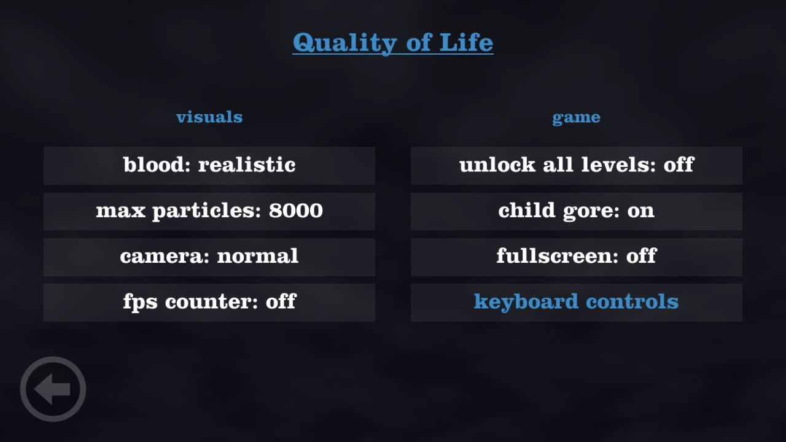

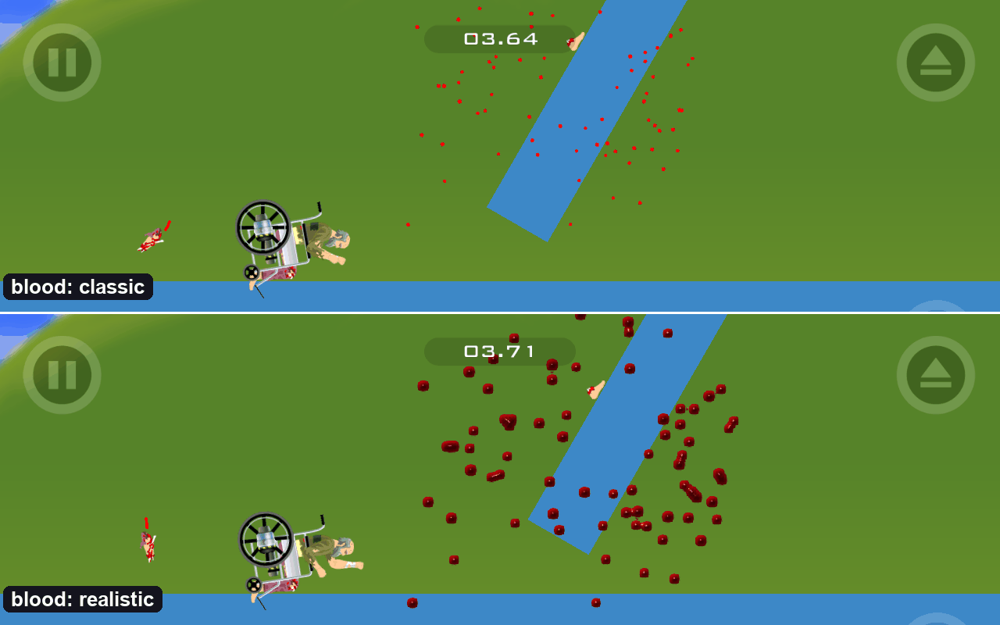

### Game controllers

Play with a controller on every platform: Xbox and PlayStation pads on Windows and Linux, any
Android controller (including the built-in controls of handhelds like the AYN Odin and Thor), and
MFi / Xbox / PlayStation pads on iOS. The controller drives, and it moves through **every menu**
with a glowing highlight on the selected button (A presses it, B goes back). R3 switches to a free
pointer for the level editor. Every action is **remappable** (three inputs each). It also has
**rumble** that follows every crash, broken bone and explosion (off / low / medium / high), and
**tilt steering** on phones, tablets and handhelds. See [docs/CONTROLLERS.md](docs/CONTROLLERS.md).

### Windows, Linux, macOS, Android and iOS

OpenWheels runs on Windows (Win32), Linux (x86_64) and macOS with mouse and keyboard, and on
Android and iOS phones and tablets with any aspect ratio. On PC the window is resizable, starts
maximized and goes fullscreen (F11) at any aspect ratio without black bars. See
[docs/DESKTOP.md](docs/DESKTOP.md) and [docs/IOS.md](docs/IOS.md).

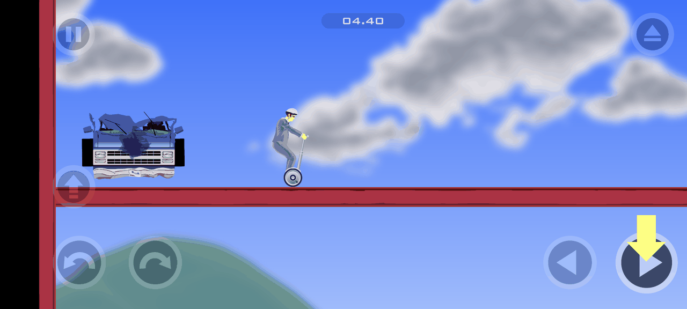

## Download and install

Builds are published on the [Releases](https://github.com/officialmelon/OpenWheels/releases) page,
built by the release workflow (see [docs/RELEASING.md](docs/RELEASING.md)).

- **Windows:** download `OpenWheels-windows.zip`, unzip it anywhere and run `OpenWheels.exe`.
- **Android:** download `OpenWheels-release.apk` to your device and open it. Allow installs from
  unknown sources when Android asks.
- **Linux:** download `OpenWheels-linux-x86_64.tar.gz`, unpack it and run `./OpenWheels`.
- **macOS, iOS:** unsigned packages when the release has them, otherwise build from source (below).

## Controls

On touch screens the controls are the same as the mobile game's. On PC, the mouse acts as touch
and these keys work by default (remap them in *Options → quality of life → controls*):

| Key | Action |
|---|---|
| Up / W | Forward (accelerate) |
| Down / S | Back (brake / reverse) |
| Left / A | Lean back |
| Right / D | Lean forward |
| Space | Special action (jump, jet, brake, fire a vehicle's guns; grab when ejected, grab your vehicle to get back on) |
| Z | Eject |
| Shift / Ctrl | Character actions (restored characters, e.g. Helicopter Man's magnet) |
| Esc / P | Pause |
| R | Restart |
| F11 | Toggle fullscreen |

With a game controller: sticks / d-pad drive and lean, RT / LT accelerate and brake, A is the
special action, Y ejects, X / B and LB / RB are the extra actions, Start pauses and Back restarts.
In menus, the d-pad / left stick moves the highlight, A selects and B goes back. Remap them in
*Options → quality of life → controller*. See [docs/CONTROLLERS.md](docs/CONTROLLERS.md).

## Building from source

The source tree contains no game assets. To build and run OpenWheels you need **your own copy** of
the game files, placed under `binary/` in the repo. `binary/` is git-ignored and never committed.

```
binary/
  HappyWheels_Android/
    HW_Android/assets/                         required: the Android game's assets folder
                                               (shared/, sounds/, large/, medium/, small/, tiny/)
    config.arm64_v8a/lib/arm64-v8a/libMyGame.so  required: the original arm64 game library, used
                                               at build time to generate the sound table and the
                                               UI text (gametext.tsv, soundlist.tsv)
  HappyWheels_iOS/Payload/happywheels.app/     optional: the iOS app, for the level editor's art
                                               and text
  flash/                                       optional: browser-game files for the extras
    swf/game_e_v1_87_g.dec.swf                 decrypted browser game: online-level item art,
                                               text-box fonts, child gore
    swf/characters/character<N>.swf            the restored characters
    swf/happy_sounds_v1_72.swf                 browser-game sounds
    tools/ffdec/                               JPEXS FFDec, used to read the SWFs
```

The optional parts are skipped quietly when they are missing. Without the iOS app there is no
editor art. Without the SWFs the restored characters aren't available and online-level items
draw as plain shapes.

### Windows

Requirements:

- Visual Studio 2022 with the C++ desktop workload (MSVC v143, Win32). The build uses Visual
  Studio's bundled CMake.
- Python 3 with `unicorn` and `capstone` (`pip install unicorn capstone`), to generate the tables
  from `libMyGame.so`.
- For the browser-game extras: Java 11+, FFDec, `numpy` and `Pillow`, and `ffmpeg` for the
  sounds.

```powershell
git clone https://github.com/officialmelon/OpenWheels.git
cd OpenWheels
powershell -ExecutionPolicy Bypass -File tools\fetch_engine.ps1   # cocos2d-x 3.17.2 + dependencies
powershell -ExecutionPolicy Bypass -File tools\build.ps1          # RelWithDebInfo by default
build\bin\OpenWheels\RelWithDebInfo\OpenWheels.exe
```

`tools\build.ps1 -Config Debug|Release` picks the configuration. If you only have Visual Studio
2026 installed, use `-Generator "Visual Studio 18 2026" -Toolset v145` with a separate
`-BuildDir`. `tools\package_windows.ps1` makes the release folder and zip (`dist\OpenWheels-windows\`
and `dist\OpenWheels-windows.zip`).

The game finds its assets in `assets\` next to the exe, or in `binary\HappyWheels_Android\...` in
the repo, or wherever `--assets <dir>` points.

Useful command-line options:

| Option | Effect |
|---|---|
| `--width <px> --height <px>` | Window size (picks the original's art tier) |
| `--assets <dir>`, `--ios-app <dir>` | Use game files from another location |
| `--play-level <file.xml>` | Play a level file directly (`--select-character <id>` opens character select) |
| `--play-online <id>` | Play a browser level by its id |
| `--open <file>` | Import a `.happywheels` or level file (dragging it onto the exe does the same) |
| `--console` | Log to a console window instead of `openwheels.log` |
| `--dump-world <out.json>` | Verification: dump the Box2D world for comparison with the oracle |
| `--convert-flash <in> <out>` | Convert a browser level to the mobile format |

If the game crashes or hangs, it writes `openwheels_crash.txt` (with a minidump) or
`openwheels_hang.txt` next to the exe. Please attach these to bug reports.

### Linux and macOS

```sh
tools/fetch_engine.sh     # cocos2d-x 3.17.2 + dependencies into thirdparty/
tools/build.sh            # RelWithDebInfo by default; --config Debug|Release
build-linux/bin/OpenWheels/OpenWheels   # or build-macos/bin/OpenWheels/OpenWheels.app
```

Linux needs CMake 3.13+, GCC or Clang, Python 3 and the engine's system libraries (X11, GTK 3,
GLEW, OpenAL, libvorbis, libmpg123, ...; the apt line is in [docs/DESKTOP.md](docs/DESKTOP.md)).
The generators need the same Python packages and tools as on Windows. Game files are looked up in
`--assets <dir>`, `assets/` next to the executable, `~/.local/share/OpenWheels/assets` (macOS:
`~/Library/Application Support/OpenWheels/assets`) or `binary/` in the repo.

### iOS

On a Mac with Xcode: `tools/fetch_engine.sh`, then `OW_IOS_TEAM=<team id> tools/build.sh --ios`
(or open the generated `build-ios/OpenWheels.xcodeproj`). Your game files are bundled when
`binary/` has them, or can be copied onto the device with Finder. See [docs/IOS.md](docs/IOS.md).

### Android

Requirements: the Android SDK (`tools\build_android.ps1` installs the platform, build tools, CMake
and NDK r27 it needs), JDK 17+ (Android Studio's bundled one works), and Python 3 with `unicorn`.

```powershell
powershell -ExecutionPolicy Bypass -File tools\build_android.ps1                      # debug APK
powershell -ExecutionPolicy Bypass -File tools\build_android.ps1 -Config Release
powershell -ExecutionPolicy Bypass -File tools\build_android.ps1 -Abis arm64-v8a -Run # build, install, launch
```

Gradle copies your game files from `binary/` into the APK. The APK is written to
`build\android\OpenWheels-<config>.apk`. Release builds are signed with the keystore that
`OW_KEYSTORE_PROPERTIES` describes, or with the debug key if it isn't set. See
[docs/ANDROID.md](docs/ANDROID.md).

## Project layout

```
src/game/        the 1:1 reconstruction of the Android game, one .h/.cpp per original class
                 (app, audio, services, session, render, level, items, triggers, characters,
                 vehicles, gameplay, menus, debug)
src/editor/      the iOS level editor port (model, core, ui, persistence)
src/online/      online browser levels: level API client, browser, Flash-to-mobile converter,
                 browser-level runtime, NPCs and items
src/restored/    the five restored browser characters and their vehicles
src/qol/         the Quality of Life options and the blood compositor
src/input/       game controllers, menu focus navigation, rumble and tilt steering
src/platform/    Win32, Linux, macOS, iOS and Android entry points (desktop/: keyboard bridge and
                 window shared by the PC builds, unix/: POSIX main), crash handlers, shared helpers,
                 no-op stand-ins for the mobile SDKs (ads, analytics), Box2D world dumper
android/         the Android Gradle project
tools/           build scripts, window capture and input helpers
tools/re/        reverse-engineering and verification tools (emulator oracle, parity, world diff)
tools/assets/    build-time generators for the browser-game art and sounds (from your own files)
tools/levels/    browser-level decoding, the restored characters' level generator and previewer
res/levels/      OpenWheels' own levels (the restored characters' campaign chapters)
tools/parity/    compiler parity experiments
docs/            documentation (see below)
```

Code outside the 1:1 reconstruction is marked in the source (`EDITOR (iOS port)`,
`ONLINE (PC addition)`, `RESTORED (PC addition)`, `QOL (PC addition)`). All of it is gated, so the
campaign keeps behaving exactly like the original.

## Documentation

See [CHANGELOG.md](CHANGELOG.md) for what changed in each release.


[docs/README.md](docs/README.md) is the index. The main documents are:

- [RECONSTRUCTION.md](docs/RECONSTRUCTION.md): how the reconstruction was done, its rules and
  tools
- [PARITY.md](docs/PARITY.md): physics parity against the original
- [EDITOR_PORT.md](docs/EDITOR_PORT.md): the level editor port
- [FLASH_LEVELS.md](docs/FLASH_LEVELS.md): online browser levels
- [RESTORED.md](docs/RESTORED.md), [QOL.md](docs/QOL.md), [CONTROLLERS.md](docs/CONTROLLERS.md),
  [ANDROID.md](docs/ANDROID.md)
- [MODULES.md](docs/MODULES.md), `docs/modules/` and `docs/editor/`: per-class work notes

## Credits

- *Happy Wheels* was created by **Jim Bonacci** and published by **Fancy Force**
  ([totaljerkface.com](https://totaljerkface.com)).
- The user levels in the online browser belong to their authors.
- OpenWheels is built on [cocos2d-x](https://github.com/cocos2d/cocos2d-x) (MIT) and
  [Box2D](https://box2d.org) (zlib).

## Legal

OpenWheels is an unofficial, non-commercial fan project. It is not affiliated with, endorsed by or
sponsored by Fancy Force or Jim Bonacci. *Happy Wheels* is their trademark, and its art, sounds,
text and levels are their property. This repository contains no game assets; building it requires
your own copy of the game. If you enjoy OpenWheels, please support the official game.

The full notice is in [NOTICE.md](NOTICE.md).

## License

The OpenWheels source code is released under the [MIT License](LICENSE), © 2026 officialmelon.
The license covers only the OpenWheels code. It doesn't cover Happy Wheels or any of its assets.
